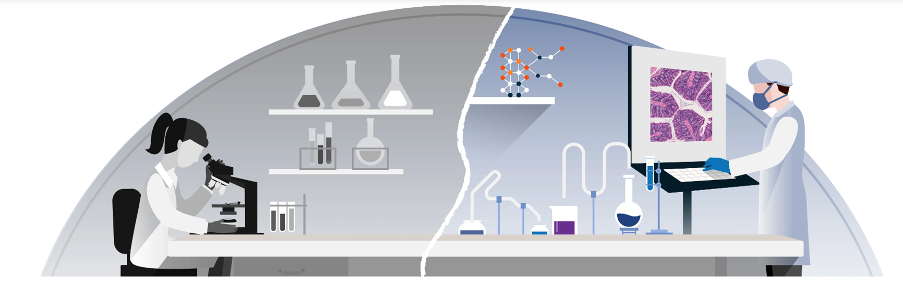
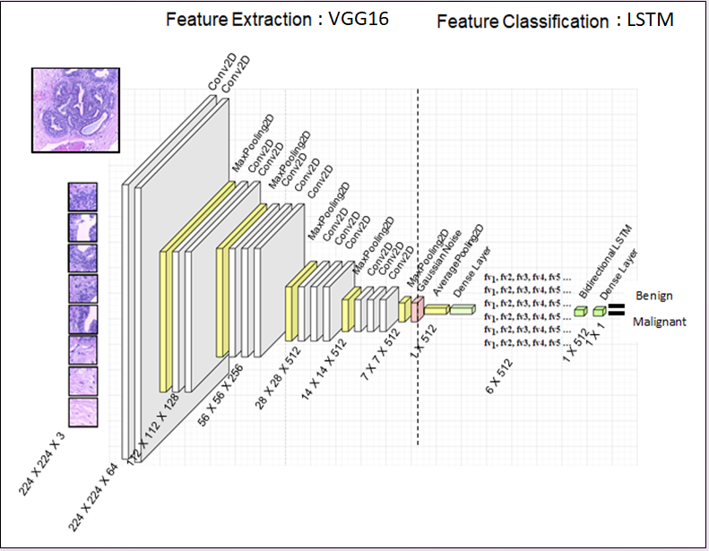

  

<h1 align="center">
Leveraging Deep Learning and Medical Image Analysis for Enhanced Breast Cancer Diagnosis </h1>

Deep learning has brought remarkable advancements to the field of medical image analysis, introducing algorithms like convolutional neural networks (CNNs), recurrent neural networks (RNNs), generative adversarial networks (GANs), etc. These sophisticated algorithms can be utilised with the objective of augmenting the precision and efficiency of cancer diagnostics while concurrently diminishing errors. Focusing on the domain of breast cancer histopathological images, this study delves into a diverse array of strategies with the intent of elevating the accuracy and efficiency of classification.

The intricacies embedded within high-resolution images hold a pivotal role in ensuring the precise detection and characterization of cancer. Nevertheless, the inherent complexity of these images gives rise to challenges, necessitating the development of specialised methodologies tailored for resource-conscious, cost-effective, and efficient processing. This study introduces a novel approach tailored for high-resolution histopathology image analysis, aiming to enhance both accuracy and performance in medical image classification

The architecture put forth harnesses the advantages of patch-based image analysis through the seamless integration of a transfer learning Visual Geometry Group (VGG) 16 model with an LSTM (Long Short-Term Memory) classifier. This combination results in a powerful solution for the precise classification of high-resolution histology images. By utilising pre-trained models as feature extractors, the system gains the ability to capture intricate image features that contribute to accurate diagnoses. The LSTM classifier goes a step further in augmenting accuracy by capturing temporal dependencies among image patches. This addresses the challenge of losing global context for structures or features that are frequently disregarded in traditional approaches.

The effectiveness of this strategy becomes unmistakably clear from its results. Attaining an impressive accuracy of 90.05%, coupled with elevated precision, recall, and AUC values at 100X magnifications, underscores the model's proficiency in high-resolution analysis. The patch-based approach optimally processes large-dimensional tumour regions without the need for resource-intensive whole slide image (WSI) analysis and showcasing its prowess in capturing intricate details for precise classification. This scalability contributes to quicker processing times, allowing for swift predictions and efficient utilisation of computational resources.

  

